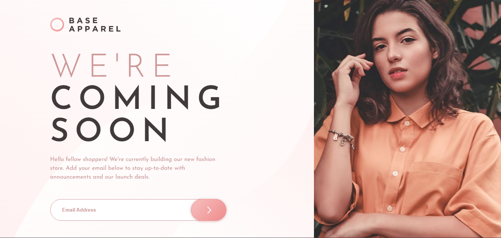

 

## Table of contents

- [Overview](#overview)
  - [The challenge](#the-challenge)
  - [Screenshot](#screenshot)
  - [Links](#links)
  - [Built with](#built-with)
  - [What I learned](#what-i-learned)
- [Author](#author)

## Overview

This is a solution to the [Base Apparel coming soon page challenge on Frontend Mentor](https://www.frontendmentor.io/challenges/base-apparel-coming-soon-page-5d46b47f8db8a7063f9331a0).

### The challenge

Users should be able to:

- View the optimal layout for the site depending on their device's screen size
- See hover states for all interactive elements on the page
- Receive an error message when the `form` is submitted if:
  - The `input` field is empty
  - The email address is not formatted correctly

### Screenshot

These are my screenshots of my work 

### Links

- Solution URL: [Solution](https://iceberg61.github.io/icebeBase-Apparel-coming-soon-page/)

### Built with

- Semantic HTML5 markup
- CSS custom properties
- Flexbox
- CSS Grid
- Mobile-first workflow

### What I learned

WOW😏. I learnt a lot of things through trial and error.
Am just grateful i get the chance to solidify my skill on coding.

## Author

- Frontend Mentor - [@iceberg61](https://www.frontendmentor.io/profile/iceberg61)
- Twitter - [@ayanakoji_kiyo](https://www.twitter.com/ayanakoji_kiyo)
